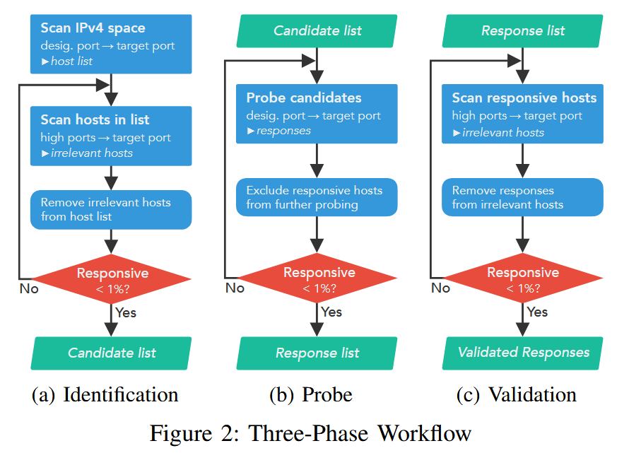

# Replication of sp25-misconf-fw

Paper: Q Deng, et at. "Beyond the Horizon: Uncovering Hosts and Services Behind Misconfigured Firewalls". IEEE SP 25.

## Experiment

指定端口：1. TCP 80, 2. UDP 53

目标服务：1. SSH TCP22, 2. FTP TCP21, 3. MySQL TCP3306, 4. HTTP TCP80



### 第一阶段：识别受影响的主机。

在此阶段，我们挖掘那些只有在从指定端口连接时才响应目标端口的主机。步骤如下：

1. 从指定端口扫描IPv4空间，针对目标端口。响应的主机构成初始主机列表，包括受影响主机和无关主机。
2. 从随机的高端口扫描目标端口的目标主机列表。响应的主机是不相关的，因为它们可以从高端口访问。
3. 从当前主机列表中移除不相关的主机。
4. 重复步骤 2 & 3，直到响应率低于1%，确保低误报率。剩余的主机形成候选列表。


### 第二阶段：探测受影响的服务。

在这个阶段，我们发送应用层探测并收集响应以进行特征提取。步骤如下：

1. 向候选主机的指定端口发送探测（例如，HTTP或DNS请求）。
2. 记录响应，并将响应的主机从进一步的探测中排除。
3. 重复步骤 1 & 2，直到响应率低于1%，确保高覆盖率。聚合的响应构成响应列表。


### 第三阶段：验证误报率。

在这个阶段，我们通过再次扫描受影响服务的高端口来确认期望的误报率。步骤如下：

1. 扫描随机高端口响应列表中的服务。响应的主机是新无关的主机，因为它们的服务从高端口变得可达。
2. 删除之前从无关主机收集的响应。
3. 重复步骤 1 & 2，直到响应率低于1%，确保期望的误报率。剩余的响应是验证后的响应。

---

## Usage

Environment: WSL

- 安装依赖：
  - 安装 Python 3.10+，并将 `python`、`pip` 加入环境变量 PATH。
  - 安装 zmap: `sudo apt install zmap`。

- 安装 Python 依赖：

```bash
pip install -r requirements.txt
```

- 运行三阶段流程（自动选择扫描器，优先 zmap，找不到则用 masscan）：

```bash
python pipeline.py run-all --output-dir outputs --rate 10000 --scanner auto
```

- 指定使用 masscan（推荐 Windows）：

```bash
python pipeline.py run-all --output-dir outputs --rate 10000 --scanner masscan
```

- 可选参数：
  - `--iface`：网卡名称（masscan 用 `-e` 指定，示例 `Ethernet`）。
  - `--exclude-file`：排除地址文件。
  - `--seed`：随机高端口种子。

- 输出：`outputs/` 将生成扫描 CSV、IP 列表与 JSONL 探测结果。